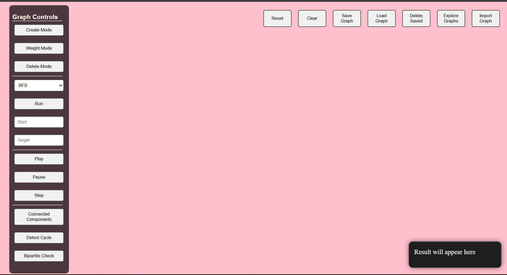
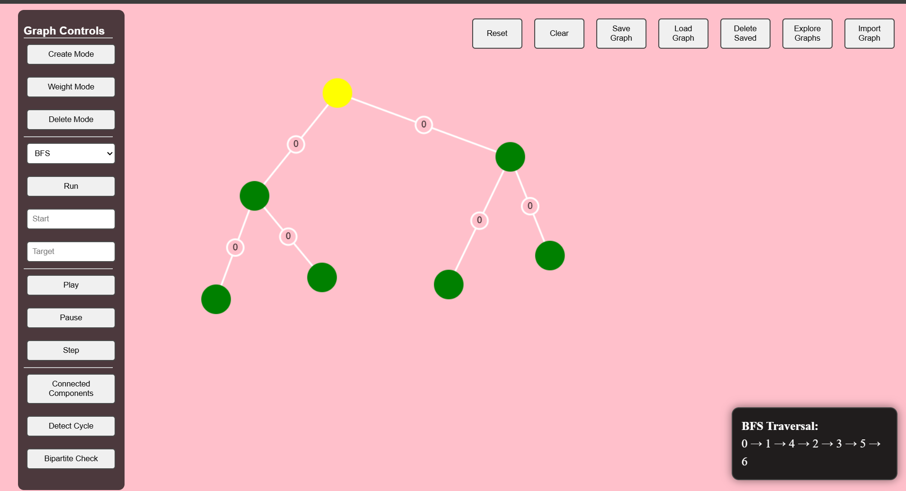
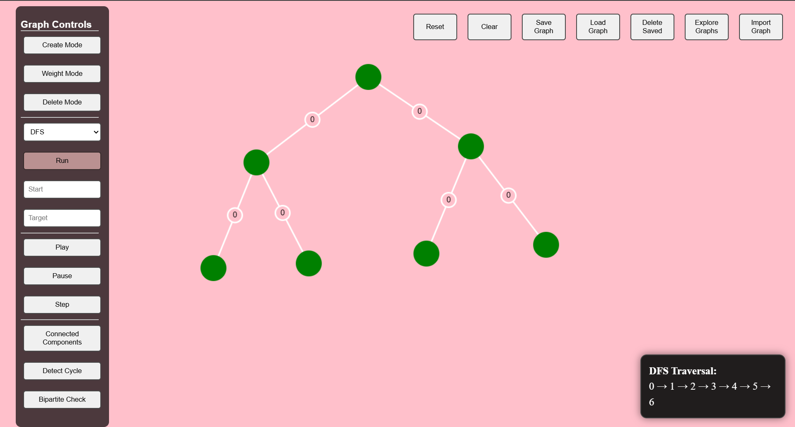

#  Graph Algorithm Visualizer

An interactive, web-based Graph Algorithm Visualizer built with **HTML, CSS, and JavaScript** using the **Canvas API**. Create custom graphs and watch 10+ classic graph algorithms execute step by step — with full playback controls and graph persistence.


---


##  Screenshots

### Home Screen


### BFS Visualization


### DFS Visualization


---

##  Features

###  Graph Builder
- Add and delete nodes by clicking on the canvas
- Create and delete edges between nodes
- Assign and edit weights on edges
- Reset canvas or reload saved graphs instantly

###  Algorithms Supported

| Category | Algorithms |
|----------|-----------|
| **Traversal** | Breadth First Search (BFS), Depth First Search (DFS) |
| **Shortest Path** | Dijkstra's Algorithm, A* Pathfinding |
| **Minimum Spanning Tree** | Prim's Algorithm, Kruskal's Algorithm |
| **Graph Properties** | Connected Components, Cycle Detection, Bipartite Check |

###  Playback Controls
- **Play / Pause** algorithm animation at any point
- **Step forward** through each algorithm state manually
- Speed control for animation pacing

###  Graph Persistence
- Save named graphs to local storage
- Load previously saved graphs instantly
- Delete saved graphs
- Export graphs as JSON files
- Import graphs from JSON files

---

##  Tech Stack

| Technology | Usage |
|------------|-------|
| HTML5 | Structure and layout |
| CSS3 | Styling and responsive design |
| JavaScript (Vanilla) | Algorithm logic and interactivity |
| Canvas API | Graph rendering and animations |

---

##  Getting Started

### Prerequisites
Just a modern web browser — no installations needed.

### Run Locally

```bash
# Clone the repository
git clone https://github.com/your-username/graph-visualizer.git

# Navigate into the project
cd graph-visualizer

# Open in browser
open index.html
```

Or use the **Live Server** extension in VS Code for hot reload.

---

##  Project Structure

```
graph-visualizer/
│
├── index.html          # Main entry point
├── style.css           # Styling
├── script.js           # Core logic — graph, canvas, algorithms
│
├── /screenshots        # Preview images
│   ├── home.png
│   ├── bfs.png
│   └── dfs.png
│
└── README.md
```

---

##  How It Works

- **Nodes** are stored as objects with `x, y` coordinates and a colour state representing algorithm progress
- **Edges** store connections between node indices along with weights
- The graph is internally represented as an **adjacency list**
- Each algorithm generates a **step array** — a sequence of graph states
- An **animation engine** processes steps one by one, updating node/edge colours to visualise traversal in real time
- **Playback controls** allow pausing, resuming, and manually stepping through any algorithm
- **Graph persistence** serialises node/edge data to JSON for local storage and file export

---

##  Algorithms — How They're Implemented

### Traversal
- **BFS** — iterative queue-based traversal, visualises level-by-level exploration
- **DFS** — recursive stack-based traversal, visualises backtracking

### Shortest Path
- **Dijkstra** — min-heap priority queue, highlights shortest path tree on completion
- **A\*** — heuristic-based pathfinding using Euclidean distance, faster than Dijkstra on sparse graphs

### Minimum Spanning Tree
- **Prim's** — greedy edge selection from visited set, visualises MST growth
- **Kruskal's** — Union-Find (Disjoint Set Union) based, sorts edges by weight

### Graph Properties
- **Connected Components** — multi-source BFS/DFS, colours each component differently
- **Cycle Detection** — DFS with back-edge tracking for directed graphs
- **Bipartite Check** — 2-coloring via BFS, highlights conflicting edges if not bipartite

---

##  Possible Extensions

- Mobile responsive UI
- Directed vs undirected graph toggle
- Algorithm complexity comparison panel
- Dark mode

---

##  Acknowledgements

Built to deepen understanding of:
- Graph theory and algorithm design
- Canvas-based rendering and animation in JavaScript
- State management for step-by-step visualisation